# Exact

**Write an app once. It runs natively on the web, macOS, iOS, and Linux, and an AI
agent can build it, run it, see it, and test it on every one of them.**

> [!TIP]
> **Try it with a coding agent.** On a Mac with Xcode, Rust, Bun, and Chrome installed,
> give Claude Code this prompt:
>
> ```text
> Clone https://github.com/ccheever/exact2 and follow its README to make a new Exact
> app with `exact new`: a todo list where I can add items, check them off, delete them,
> and see how many are left. Put the view in Contract and keep the list in `app.ts`.
> Write an `app.test.contract`, pass it on web, macOS, and the iOS Simulator with
> `scripts/agent.mjs`, then open the app for me on all three.
> ```
>
> A fresh Claude Code session given this prompt finished in about 23 minutes, most of it
> spent on the first native builds, and its tests passed on all three platforms. On a
> machine that has never built Hermes, that build comes first and adds time.

<table>
  <tr>
    <th>Web</th>
    <th>macOS</th>
    <th>Linux</th>
  </tr>
  <tr>
    <td>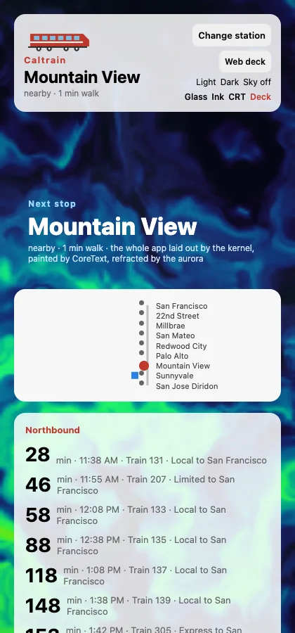</td>
    <td>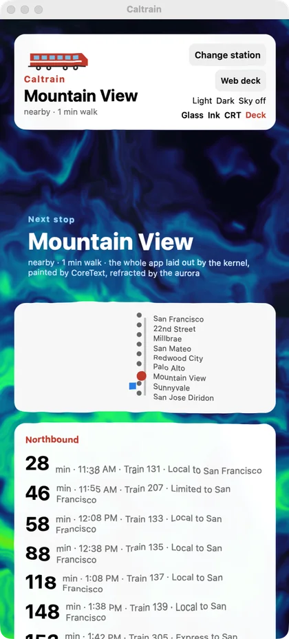</td>
    <td>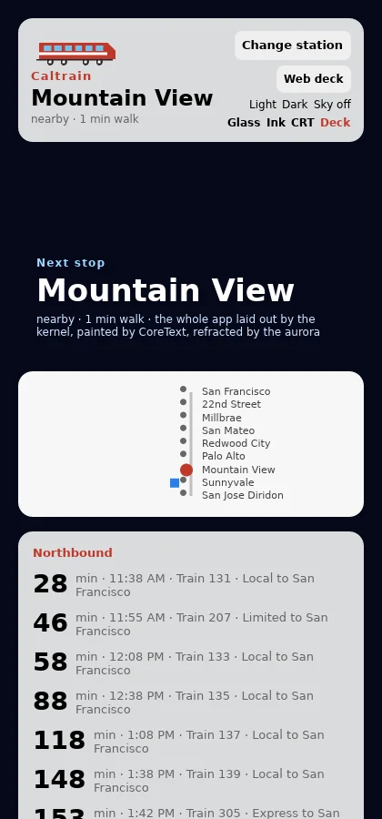</td>
  </tr>
  <tr>
    <td>The browser's own DOM and CSS</td>
    <td>AppKit views, CoreText, Metal sky</td>
    <td>Painted by vello / tiny-skia, headless here</td>
  </tr>
</table>

<sub>One <code>app.contract</code>, three hosts, captured by the agent driver from this
checkout. (The aurora behind the macOS and web versions is an optional GPU module.)</sub>

Exact is a cross-platform application runtime. You describe your interface in
**Contract**, a small declarative language, and you write your data logic in
**TypeScript or Rust**. The Contract compiler turns the interface into a compact
*plan*. On the web, that plan becomes one ES module over a ~20 KB runtime that drives
the real DOM. On macOS, iOS, and Linux, a Rust runner executes the same plan, a Rust
layout kernel computes every box with CSS rules, and each platform draws with its own
tools: AppKit, UIKit, or a GPU painter. There is no webview and no JavaScript bridge
in the UI, and no app JavaScript runs before the first pixel.

> [!NOTE]
> Exact is pre-1.0 and changes daily. There is no API stability, no backwards
> compatibility, and no migration guide, by design (`rules/DEFERRED.md`). This
> repository, `exact2`, is a rebuild of an earlier one ("exact1"). Its design documents
> are imported under `llp/research/` as research, never as authority.

## Contents

- [Three principles](#three-principles)
- [How it works](#how-it-works)
- [Quick start](#quick-start)
- [Contract](#contract)
- [Example apps](#example-apps)
- [What works today, and what doesn't yet](#what-works-today-and-what-doesnt-yet)
- [Repository map](#repository-map)
- [Working on Exact](#working-on-exact)

## Three principles

### 1. Agent native

Exact assumes much of the code will be written by AI agents. An agent can make an app,
run it, look at it, operate it, and prove it works without a person in the loop.

- **Nine operations, the same on every host.** `tree · screenshot · tap · type · state
  · layout · logs · clock · prefer` drive the web, macOS, iOS (Simulator or a real
  iPhone), and Linux through one script, `scripts/agent.mjs`. There are nine on purpose:
  the predecessor's agent API grew to eighty wire names, one reasonable addition at a
  time.
- **The clock belongs to the agent.** Between two operations nothing moves. Instead of
  sleeping until an animation finishes, the agent says `clock +60000` or
  `clock settle` and reads the result. No timing flakes, no waits.
- **Tests are scripts of those operations.** An `app.test.contract` file runs unchanged
  on any host, with no second evaluator.
- **Every tool speaks to machines.** `contract build --json` gives diagnostics with
  stable ids and source ranges. `contract symbols` gives navigation. A development
  source map leads from any node on screen back to the line that declared it.
  The driver refuses to drive a build older than its sources and names the rebuild.
- **Contract is small on purpose.** A whole app fits in a context window. Every write
  is declared, every list is keyed, every value is typed. Mistakes are refusals that
  say what to do, not quiet misbehavior.

```sh
bun scripts/agent.mjs web tree "tap change-station" "type station-search Palo" \
  "clock +60000" state "screenshot out.png"
```

### 2. Speed is king

Speed of the app and speed of the loop. Each budget in `rules/RULES.md` is tracked on
every commit, and a regression is a P0 with a name on it.

| Budget | Target |
|---|---|
| Cold start to interactive first frame | 100 ms p50 |
| Dev restart, edit to present | 100 ms p50 |
| App JavaScript executed before first pixel | none |
| Touch one line, rebuild that crate | 30 s |
| The whole blocking check suite | 60 s |

How the design keeps those numbers:

- **The boot path executes and compiles nothing.** TypeScript is compiled to Hermes
  bytecode at build time and loads after the first pixel. The first frame comes from
  data baked into the plan.
- **Pay only for what you use.** GPU rendering, the Markdown editor, text flow, and
  browser SQLite are separate artifacts, loaded on demand. Nothing is a feature flag
  on a core crate.
- **The web gets its own small runtime.** On the RealWorld ("Conduit") benchmark,
  Exact's runtime was up about 300 ms before the React SSR build had hydrated. It used
  26 KB of code against React's 81 KB
  ([LLP 1071](llp/1071-exact2-web-target.rfc.md)).
- **Edits land in about a tenth of a second.** On a fresh app made by `exact new`, a
  saved Contract or TypeScript edit was rebuilt and in the page in 99 ms.

### 3. The web is the standard

When a default, a property name, a value, or a behavior could follow CSS or follow
something else (React Native's Yoga, UIKit, AppKit), Exact follows CSS, even where a
CSS reset would usually override it.

- A bare node is `display: block`, `box-sizing: content-box`, `flex-direction: row`,
  `flex-shrink: 1`, the same as a bare `<div>`.
- Properties are CSS's: `font-size`, `object-fit`, `text-overflow`, `line-clamp`,
  `light-dark()`, `env(safe-area-inset-top)`. The compiler refuses an alias and names
  the web's spelling.
- The browser is the parity oracle. Native layout, Canvas 2D, SVG, gradients, and
  motion are checked against what Chrome draws.
- The web is also the development loop. You work on the seconds-long web loop, and the
  native hosts are swept behind you.
- Any unavoidable deviation is declared, with its reason, in
  [`llp/1001-kernel-v1.spec.md`](llp/1001-kernel-v1.spec.md). For example, Taffy has no
  `position: static`.

Following the web doesn't mean the lowest common denominator. Where a platform can do
more (real HTML in an SVG `foreignObject` on the web, MapKit through a native module on
Apple), Exact lets it.

## How it works

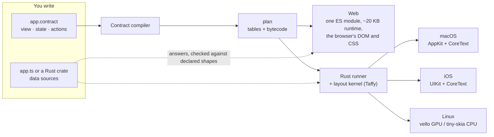

- **Contract** (`contract/`) is compiled in four passes: syntax, types, analysis, and
  lowering. At build time the plan is *baked*: constant data is evaluated into it, so
  the first frame needs nothing else.
- **The runner** (`runner/`) is the plan's virtual machine. It handles keyed component
  instances, events, timers on a seekable clock, and the data seam.
- **The kernel** (`kernel/`) is a columnar node arena with CSS layout through a patched
  [Taffy](vendor/taffy/EXACT-PATCHES.md). The host measures text: CoreText on Apple,
  cosmic-text on Linux. On the web, the browser lays out the same CSS itself, so the web
  build carries no layout engine.
- **Hosts** (`host/`) present the tree. The web host writes DOM nodes, and the browser
  runs CSS transitions. The Apple host is a static library with a C ABI under AppKit and
  UIKit presenters. The Linux host paints the tree itself, onto DRM/KMS with evdev
  input, or into an offscreen buffer.
- **Data sources** sit below one seam. TypeScript runs on Hermes on native hosts and in
  the browser's own engine on the web. Rust runs natively, and can be replaced live
  (as a shared library, or as Wasm on iOS and the web). Every answer is checked against
  the shape Contract declared. Grants control network, files, SQLite, and secrets.
- **Optional pieces** are separate artifacts: a wgpu GPU module (Metal on Apple, WebGPU
  in the browser), native modules (a hyphenated tag backed by a platform widget, like
  MapKit), and a [game engine](game/README.md) add-on.

## Quick start

These steps were run on macOS on Apple Silicon. Linux works for the web loop and the
Linux host.

### 1. Install the tools

- **Rust** through [rustup](https://rustup.rs). The pinned stable toolchain in
  `rust-toolchain.toml` installs itself the first time Cargo runs.
- **[Bun](https://bun.sh) 1.4.2**, the version `package.json` pins. Node and npm are
  not needed.
- **Google Chrome.** The agent drives the web through headless Chrome. Set `CHROME` to
  use another Chromium.
- **Xcode**, for the macOS and iOS hosts.
- **Hermes**, only for TypeScript apps on native hosts. Clone
  [expo/ibex](https://github.com/expo/ibex) beside this repository and build it once:
  `git clone https://github.com/expo/ibex ../ibex && (cd ../ibex && ./scripts/build-hermes.sh --vanilla)`.

To install the pinned Bun beside any existing installation:
`curl -fsSL https://bun.sh/install | BUN_INSTALL=~/.bun-1.4.2 bash -s bun-v1.4.2`.
Use `~/.bun-1.4.2/bin/bun` for the commands below if it is not on your PATH.
`bun scripts/exact.mjs setup` installs the declared stable and web nightly Rust
toolchains, their components/targets, matching wasm-bindgen, pinned Binaryen and
Bun dependencies. It keeps Binaryen in `~/.cache/exact/binaryen`; builds find it
automatically. `setup --check` checks the installed tools without installing them.

### 2. Run Caltrain in the browser

```sh
git clone https://github.com/ccheever/exact2.git
cd exact2
bun scripts/exact.mjs setup
bun host/web/dev.mjs            # Caltrain, at http://127.0.0.1:8765/
```

The first run compiles the toolchain, which takes a few minutes. After that, open
[`apps/caltrain/app.contract`](apps/caltrain/app.contract), change some text, and save.
The page rebuilds and reloads in about a tenth of a second. Add `--lan` to open the
same page from a phone on your network.

### 3. Run it natively

```sh
bun host/apple/build.mjs --run              # macOS
bun host/apple/build.mjs --ios --run        # an iOS Simulator (--device --run for a connected iPhone)
cargo build --release -p caltrain-linux     # Linux: a DRM/KMS console, or headless anywhere
```

A first native build takes a few minutes; later builds reuse it. iOS commands use an
iPhone simulator that's already booted, or boot the newest iPhone Pro. To choose one,
set `EXACT_SIM` to its name or UDID (or pass `--sim` to `build.mjs`), and keep the same
setting for `agent.mjs ios`.

### 4. Drive it the way an agent does

```sh
bun host/web/build.mjs caltrain-web         # the build the agent's web host serves
bun scripts/agent.mjs web tree "tap change-station" "type station-search Palo" state "screenshot out.png"
bun scripts/agent.mjs web --test apps/caltrain/app.test.contract
```

Swap `web` for `macos`, `ios`, or `linux` once that host is built. Caltrain's three
tests take about two seconds on the web host. `"screenshot film.png over 600 every 50"`
films motion as a contact sheet; use an `.apng` name to get an animation.

### 5. Make your own app

```sh
bun scripts/exact.mjs new ../hello          # or run `bun link` once, then `exact new ../hello`
cd ../hello
bun exact.mjs web                           # the dev loop, at http://127.0.0.1:8765/
bun exact.mjs mac --run                     # this Mac
bun exact.mjs ios --run                     # an iOS Simulator
```

`exact new` creates a standalone app: `app.contract` (the view), `app.ts` (its data),
`app.json` (the manifest: name, bundle id, hosts, deploy policy), and small `web/` and
`apple/` host crates. It has its own Cargo workspace, which uses your exact2 checkout
by path. To drive it from exact2, point `EXACT_APP_DIR` at it:

```sh
EXACT_APP_DIR=../hello bun host/web/build.mjs hello-web
EXACT_APP_DIR=../hello bun scripts/agent.mjs web --app hello tree "screenshot hello.png"
```

`bun scripts/exact.mjs` also runs apps from this repository as real Mac apps:
`exact run markdown README.md`, or `exact install markdown` to put `mdview` on your
`PATH`. `exact list` shows what's here.

## Contract

Read the complete [guide for humans](docs/contract-for-humans.md),
[guide for agents](docs/contract-for-agents.md), or
[grammar and vocabulary reference](docs/contract-grammar.md).

Contract describes what an app shows and how its state changes. It doesn't fetch, read
files, or run arbitrary code. That's what data sources are for. Here is a complete todo
app: a Contract file, a TypeScript file, and a test. This exact app was built for web,
macOS, and the iOS Simulator, and its test passed on all three.

```
// app.contract: the view, its state, and what each action changes
shape Todo
  id: string
  title: string
  done: bool

shape Change
  count: number

style Card
  padding=12 border-radius=10 gap=10 align-items="center"
  background-color="light-dark(#f2f2f5, #1c1c1e)"

component Todos
  state draft = ""
  mutation changed as shape Change refreshes todos
  resource todos = todos() as shape list<Todo>
  derive left = length(filter(todos, t => not t.done))

  action edit(value: string)
    draft = value
  action add
    if trim(draft) != ""
      send changed = addTodo(trim(draft))
      draft = ""
  action toggle(id: string)
    send changed = toggleTodo(id)
  action remove(id: string)
    send changed = removeTodo(id)

  view
    column padding=24 gap=12
      text `${left} left` font-size=28 font-weight=700 testId="count"
      row gap=8
        input value=draft input=edit submit=add placeholder="What needs doing?" aria-label="New todo" testId="new-todo" flex=1 padding=10
        button press=add padding=10 testId="add"
          text "Add"
      each t in todos key=t.id
        row class=Card testId=`todo-${t.id}`
          button press=toggle(t.id) aria-label="Toggle" testId=`toggle-${t.id}`
            text (t.done ? "✓" : "○")
          text t.title flex=1 text-decoration-line=(t.done ? "line-through" : "none")
          button press=remove(t.id) aria-label="Delete" testId=`remove-${t.id}`
            text "✕"
```

```ts
// app.ts: keeps the list, and answers what app.contract asks for
import type { Answer, Sources } from './app.contract.d.ts';

export const appId = 'com.example.todo';
export const grants = '';  // e.g. 'net.fetch https://api.example.com'

type Todo = { id: string; title: string; done: boolean };
let todos: Todo[] = [];
let next = 1;

const sources: Sources = {
  todos: () => todos,
  addTodo: ([title]) => {
    todos = [...todos, { id: String(next++), title, done: false }];
    return { count: todos.length };
  },
  toggleTodo: ([id]) => {
    todos = todos.map((t) => (t.id === id ? { ...t, done: !t.done } : t));
    return { count: todos.length };
  },
  removeTodo: ([id]) => {
    todos = todos.filter((t) => t.id !== id);
    return { count: todos.length };
  },
};

export const answer: Answer = (source, args, store, storage, native) =>
  sources[source](args, store, storage, native);
```

```
// app.test.contract: runs on any host with `scripts/agent.mjs <host> --test`
test "add, finish and delete"
  expect text "count" == "0 left"
  type "new-todo" "Buy milk"
  tap "add"
  type "new-todo" "Walk the dog"
  type "new-todo" key "Enter"
  expect text "count" == "2 left"
  tap "toggle-1"
  expect text "count" == "1 left"
  tap "remove-1"
  expect tree missing "todo-1"
  expect tree has "todo-2"
```

<table>
  <tr><th>Web</th><th>macOS</th><th>iOS Simulator</th></tr>
  <tr>
    <td>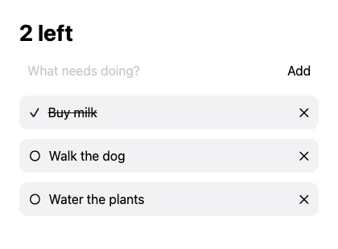</td>
    <td>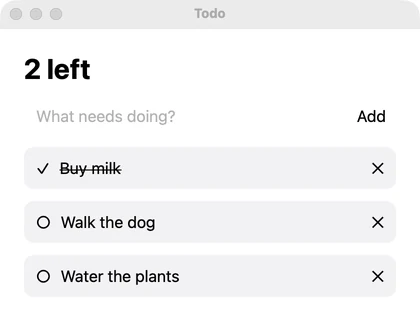</td>
    <td>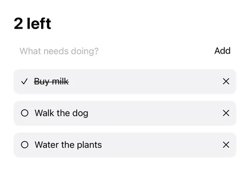</td>
  </tr>
</table>

The view never edits the list itself. An action `send`s a *mutation* to a source,
`app.ts` changes its data and answers, and `refreshes todos` asks for the list again.
Data lives in one place, and every change to it is a named, typed call an agent can see.
This list lives in memory. To keep it across launches, give `app.ts` a grant like
`sqlite.open app:/data/todos.db` and use `storage.sqlite`, as
[Fieldnotes](apps/fieldnotes) does.

### The pieces

| Concept | What it is |
|---|---|
| `shape` | A closed record type. Fields are `number`, `string`, `bool`, another shape, `option<T>`, or `list<T>`. |
| `component` | A unit of UI. The first one in a file is the root. Components take `props`, can `inject` what an ancestor `provide`s, and can fill a `slot` with `children`. |
| `state` | A value the component owns. Under an `each`, child state belongs to that keyed row. |
| `derive` | A value computed from others, recomputed when they change. |
| `resource` | Data from a source: `resource x = source(args) as shape T`. When the arguments change, the source is asked again. |
| `mutation` / `send` | A change made through a source: `send x = source(args)`. `refreshes r` asks resource `r` again afterward, and `pending(x)` and `failed(x)` show progress. |
| `action` | The only place state changes. What it writes is inferred from its body, and `let` binds a local inside it. |
| `task` | Work on a schedule: `every(1000, tick)`, `after(ms, a)`, `every(frame, a)`. |
| `view` | Indented elements, `when … else`, `each … key=…` (a key is required), `match` over options, and calls to other components. |
| `style` / `class=` | A named set of CSS properties. The node's own attributes win, and there is no cascade. |
| `fn`, `map` / `filter` / `join` | Pure, single-expression helpers. Recursion is refused. |
| Built-in functions | `length`, `trim`, `includes`, `at`, `first`, `formatDate`, `formatNumber`, and the rest are listed with their types under `stdlib` in [`plan/tables/format.json`](plan/tables/format.json). |
| `routes` | A router: a location and a retained stack per tab, moved with `open`, `push`, `replace`, and `back`, and read with `top`. |
| `font` | Declares a font family and binds it to files at build time. |
| `use … from "./x.contract"` | Imports components, shapes, styles, and `fn`s from another Contract file. |
| `testId` | A stable name for the agent, tests, and accessibility tools. |

### What Contract leaves out, and why

- **No JavaScript in the view, and no I/O.** Expressions have no effects. Effects
  happen only in actions, as assignments, `send`, `refresh`, or commands like
  `focus(…)` and `share(…)`. Data crosses one seam: a source answers, and the runner
  checks the answer.
- **No loops, no `await`.** A list is an `each`, a computation is a `derive` or a
  `fn` (an action may name a value with `let`), and anything slower lives in a
  source. A list that changes changes where its data lives, through a mutation, as
  in the example above. That's what lets the plan be baked, diffed, inspected, and
  executed the same way on four hosts.
- **No escape hatch.** Where an app needs a platform widget, it uses a *native
  module*: a hyphenated tag like `native-map`, backed by Swift or Rust, laid out by the
  kernel like any other box.

These limits serve the principles. An agent can't wire up a data race it can't write.
A plan with no JavaScript in it starts fast. A view written in CSS's own words means
the same thing on every host.

### The compiler talks back

```sh
$ cargo run -q -p contract -- build app.contract
app.contract:4:5 [type-assign] `count` is `number`, cannot assign `string`
app.contract:7:23 [lower-unknown-attr] `text` has no attribute `size`; `size` is spelled `font-size` here, the web's name (LLP 1017 §8.1)
```

One run reports up to twenty independent errors, not just the first. Other subcommands:
`--json` for tools, `symbols` (definitions and references as JSON), `fmt`
(source-preserving), `types` (generates `app.contract.d.ts` for TypeScript sources),
and `rust` (shapes for a Rust data crate). The full language is specified in
[LLP 1006](llp/1006-contract-compiler-v1.spec.md),
[LLP 1017.000](llp/1017.000-contract-v1-1.spec.md) (v1.1), and
[LLP 1017.003](llp/1017.003-map-filter-join.spec.md). Data sources are covered in
[LLP 1027](llp/1027-typescript-data-sources.rfc.md).

## Example apps

Each app lives in [`apps/<name>/`](apps). Run one on the web with
`bun host/web/dev.mjs --app <name>`, on macOS with
`bun host/apple/build.mjs <name>-apple --run`, and on iOS by adding `--ios`. All of
these screenshots come from the web host, taken by `scripts/agent.mjs`.

<table>
  <tr>
    <td width="25%"></td>
    <td width="25%">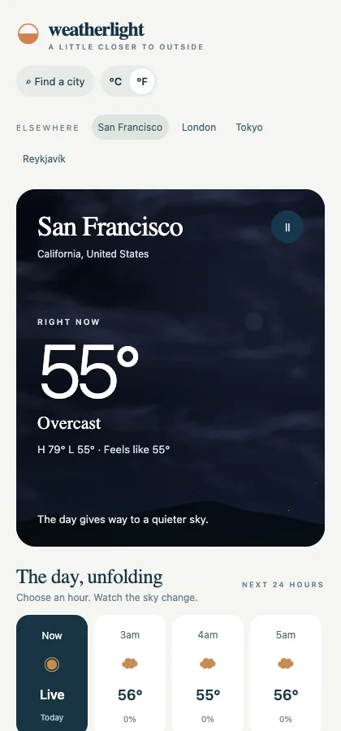</td>
    <td width="25%"></td>
    <td width="25%">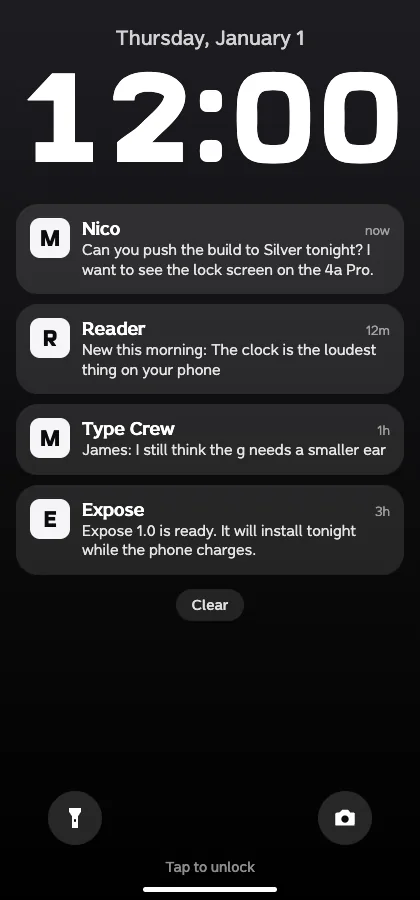</td>
  </tr>
  <tr valign="top">
    <td><a href="apps/caltrain"><b>Caltrain</b></a><br>The app that defines v1: nearby stations, live departure boards, search, theming, a Canvas 2D line map, and an aurora GPU sky. Rust data. Every host.</td>
    <td><a href="apps/weatherlight"><b>Weatherlight</b></a><br>Weather from Open-Meteo under a GPU-animated sky that follows the hour you pick. TypeScript data and a wgpu module.</td>
    <td><a href="apps/spark"><b>Spark</b></a><br>A swipe deck: throw a card with your finger, and it flies off with your release velocity. Pan gestures and springs on every host.</td>
    <td><a href="apps/expose"><b>Expose</b></a><br>A pretend phone OS (lock screen, home, Messages with an AI assistant, Reader) set in custom fonts. TypeScript. The assistant needs an OpenRouter key.</td>
  </tr>
  <tr>
    <td></td>
    <td>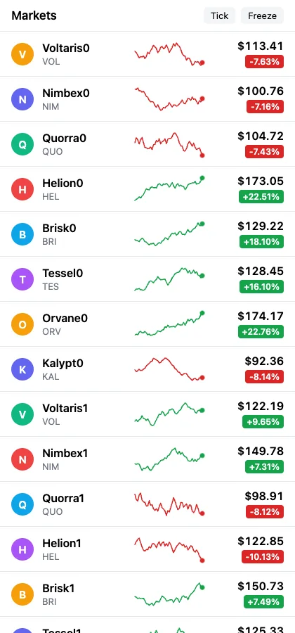</td>
    <td>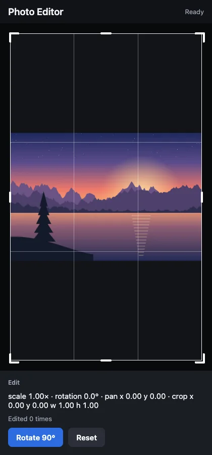</td>
    <td>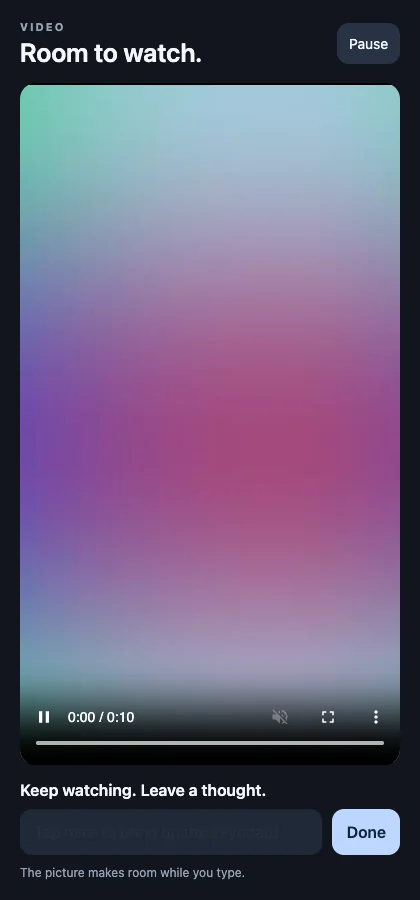</td>
  </tr>
  <tr valign="top">
    <td><a href="examples/ios/calendar"><b>Calendar</b></a><br>Month pages, draggable sheets, events dragged between days, wallpaper themes, SQLite. It lives outside <code>apps/</code>, so set <code>EXACT_APP_DIR</code> to run it.</td>
    <td><a href="apps/sparkline"><b>Sparkline</b></a><br>A market list of animated SVG charts that draw in and pulse.</td>
    <td><a href="apps/photo-editor"><b>Photo Editor</b></a><br>Rotate, pan, and crop, through a native module.</td>
    <td><a href="apps/video-player"><b>Video Player</b></a><br>A bundled clip that shrinks out of the way when the keyboard opens.</td>
  </tr>
</table>

<table>
  <tr>
    <td width="50%">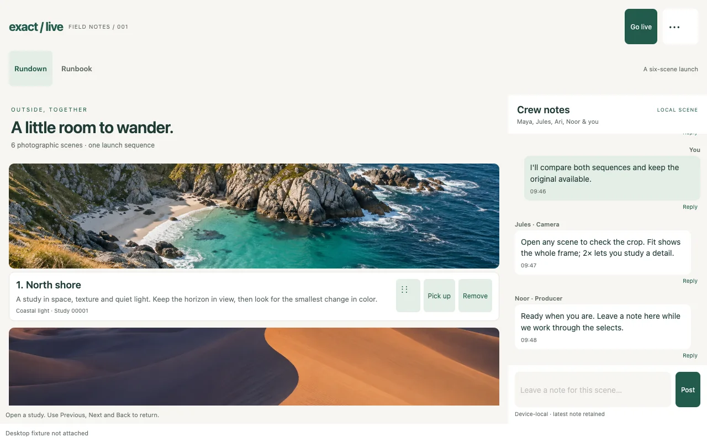</td>
    <td width="50%"></td>
  </tr>
  <tr valign="top">
    <td><a href="apps/exact-live"><b>Exact Live</b></a><br>A creative-production workspace: a photo grid you reorder by dragging, a crew chat that can take a 10,000-message burst, and a Markdown runbook. Rust data.</td>
    <td><a href="apps/interaction-gallery"><b>Still</b> (Interaction Gallery)</a><br>Drag to reorder, pan and zoom photos, a resizable sheet with a nested list, and 100 to 25,000 records.</td>
  </tr>
  <tr>
    <td>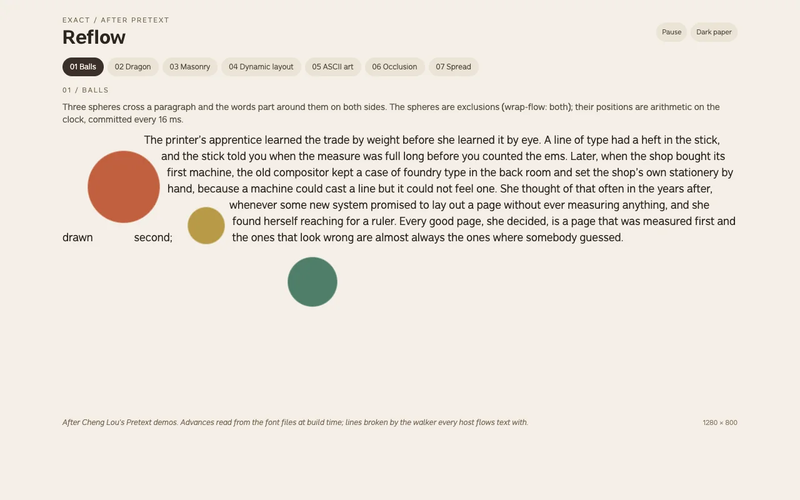</td>
    <td>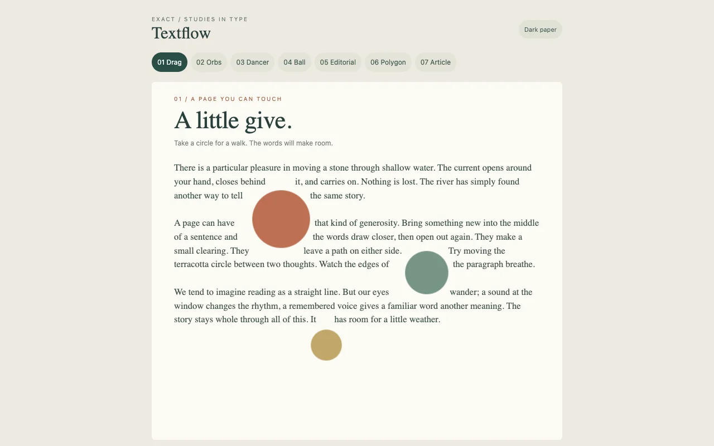</td>
  </tr>
  <tr valign="top">
    <td><a href="apps/reflow"><b>Reflow</b></a><br>Seven typography studies after Cheng Lou's Pretext demos: text flowing around moving balls, a dragon, masonry, and a magazine spread. Line heights come from font metrics read at build time.</td>
    <td><a href="apps/textflow"><b>Textflow</b></a><br>Text around shapes with CSS's <code>shape-outside</code> and <code>wrap-flow</code>: draggable orbs, a dancer, an editorial layout. One Rust walker shared by every host.</td>
  </tr>
  <tr>
    <td>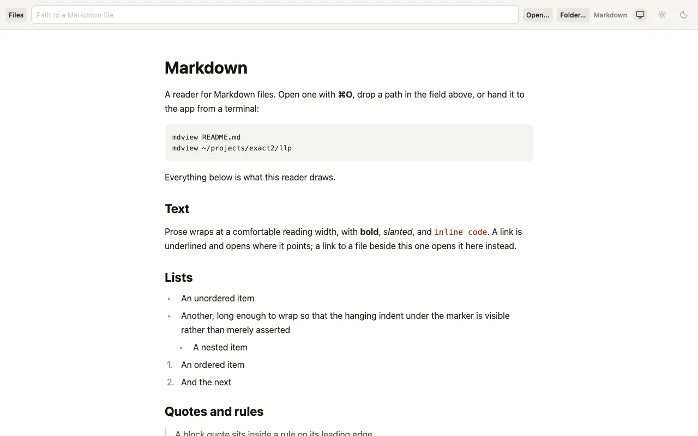</td>
    <td>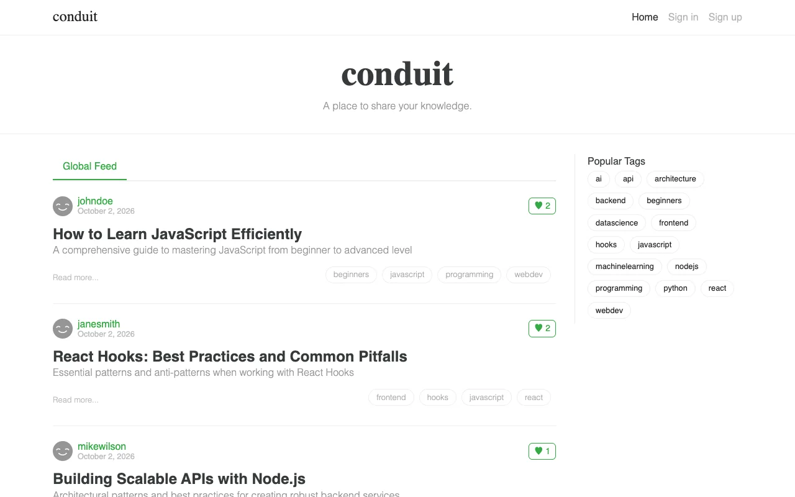</td>
  </tr>
  <tr valign="top">
    <td><a href="apps/markdown"><b>Markdown</b></a><br>A Markdown reader that opens files from Finder or the command line (<code>mdview README.md</code>). Its sibling <a href="apps/llp"><b>LLP</b></a> (<code>llpview</code>) reads this repository's design corpus.</td>
    <td><a href="apps/realworld"><b>Conduit</b> (RealWorld)</a><br>The RealWorld Medium clone against its hosted API. It's the benchmark that compared Exact's web build with React 19. Web only.</td>
  </tr>
</table>

<table>
  <tr><td>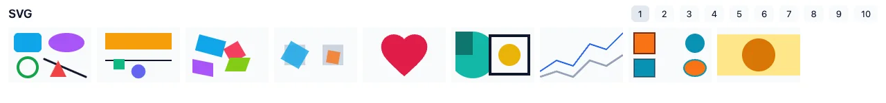</td></tr>
  <tr><td><a href="apps/svg-gallery"><b>SVG Gallery</b></a>: SVG as the browser renders it, one page per feature, held to Chrome's pixels on every host.</td></tr>
  <tr><td>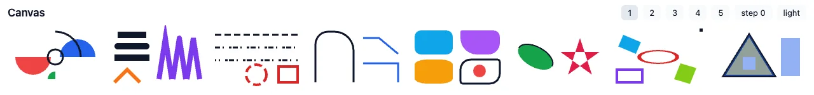</td></tr>
  <tr><td><a href="apps/canvas-gallery"><b>Canvas Gallery</b></a>: the HTML Canvas 2D API drawn by the browser, Core Graphics, or tiny-skia, and compared to Chrome.</td></tr>
</table>

### More apps, labs, and stress tests

| App | What it shows | Notes |
|---|---|---|
| [Fieldnotes](apps/fieldnotes) | A local notebook with pins, search, SQLite storage, and JSON backup and restore | TypeScript + Rust |
| [Messages](apps/messages) | A port of Expo's chat demo, talking to models through OpenRouter | Needs `bun apps/messages/service.ts` and an OpenRouter key |
| [Type Tour](apps/typetour) | Phone-OS screens as a type specimen for the Expose fonts | No JavaScript at all |
| [Recorder](apps/recorder), [Map Demo](apps/map-demo) | Native modules: a microphone waveform, MapKit on Apple and OpenStreetMap on the web | |
| [Carousel](apps/carousel) | A horizontal virtualized list of 25,000 cards | |
| [Motion Gallery](apps/motion-gallery) | Animated GIF and WebP images and CSS keyframes, compared across hosts | |
| [Update Lab](apps/update-lab) | Live replacement of Contract, TypeScript, and Rust in a running app | Hand-testing lab |
| [Messages Stress](apps/messages-stress), [Completion Storm](apps/completion-storm), [Markdown Stress](apps/markdown-stress) | 100k-message histories, 128 parallel requests, and 4 MiB documents, under load | Opt-in workloads ([LLP 1041](llp/1041-graceful-overload.rfc.md)) |
| [Native Fixture](apps/native-fixture), [Auth Fixture](apps/auth-fixture) | The native-module interface; OAuth with PAR, DPoP, and PKCE against a local server | Test fixtures |
| [Messages Legacy](apps/messages-legacy) | The earlier chat app, built on Snapback4 | Needs private Snapback access |
| [Beacons, Tennis, …](game/games) | Games on the optional [engine add-on](game/README.md): Rust gameplay, Contract menus | `bun game/dev.mjs beacons` |

## What works today, and what doesn't yet

The v1 bar, from `rules/DEFERRED.md`: *one real application, not a demo, runs from a
single Contract source on web, macOS, iOS, and Linux, within the time budgets in
`rules/RULES.md`.* Caltrain is that application, and it runs on all four. Everything
else here was admitted because a real app needed it.

### Working

- **Four hosts.** Web, macOS (AppKit, no SwiftUI), iOS (UIKit, on the Simulator and
  on devices), and Linux (GPU or CPU painting, DRM/KMS or headless). Existing Swift apps
  can embed Exact sessions through ExactKit
  ([LLP 1031](llp/1031-brownfield-embedding.rfc.md)).
- **Layout and text.** CSS block, flex, and grid; `position: static` and containing
  blocks; `aspect-ratio`; declared fonts; text around shapes
  ([LLP 1043.000](llp/1043.000-text-around-shapes.rfc.md)).
- **Paint.** Gradients, shadows, `backdrop-filter`, glass materials, complete SVG
  ([LLP 1055](llp/1055-svg-shapes-and-css-animations.rfc.md)), Canvas 2D on every host
  ([LLP 1056](llp/1056-canvas-2d.rfc.md)), and a wgpu GPU canvas loaded after first
  pixel.
- **Motion.** CSS transitions, springs, `@keyframes`, follow-and-release gestures (pan,
  swipe, pinch) with release velocity, layout transitions, exit animations, and
  scroll- or drag-linked timelines ([LLP 1002](llp/1002-motion-v1.rfc.md),
  [LLP 1063](llp/1063-presence-and-layout-motion.rfc.md)).
- **Lists.** Virtualized lists, vertical or horizontal, one level deep
  ([LLP 1070](llp/1070-nested-and-horizontal-lists.rfc.md)).
- **Controls and media.** Inputs, `select`, a WYSIWYG Markdown editor on the web, macOS,
  and iOS ([LLP 1045](llp/1045-markdown-editor.rfc.md)), images including animated
  ones, video ([LLP 1042](llp/1042-video.spec.md)), pickers for an app's declared file
  types, and share.
- **Data.** TypeScript or Rust sources, optionally on a worker. Grant-checked `fetch` and
  streams, files and SQLite (native and in the browser), Keychain secrets, and OAuth
  sign-in. A router keeps a stack per tab ([LLP 1038](llp/1038-router.rfc.md)).
- **Native modules.** Platform widgets as hyphenated tags
  ([LLP 1024](llp/1024-native-modules.rfc.md)).
- **The web, server side.** Pages pre-rendered at build time or per request by a Rust
  renderer, then adopted in place instead of hydrated
  ([LLP 1048](llp/1048-rendering-across-the-curve.rfc.md)).
- **Delivery.** `scripts/deploy.mjs` publishes the web root and signed update bundles,
  which installed apps fetch after first pixel. TypeScript and Rust logic can be
  replaced live in development. Every web build gets an install page, and
  `exact release` signs and notarizes a Mac app
  ([LLP 1030](llp/1030-delivery-unified.rfc.md)).
- **Agents and tests.** The nine operations on every host, including a physical
  iPhone; Contract tests; source maps; filmed screenshots.

### Not yet, or not at all

- **Windows and Android.** Deferred. A Direct2D host exists in the predecessor, and it
  gets ported once the loop is proven.
- **No JSX or React tier.** Nothing runs JavaScript above the data seam. The door stays
  open, but no one is building it.
- **TypeScript can't import npm packages yet.** `app.ts` imports only its own local
  files.
- **Code updates in production.** Signed delivery covers plans and assets. Signed
  delivery of TypeScript or Rust modules isn't implemented, and app-store rules limit
  it anyway.
- **Linux editing.** The web and Apple hosts edit; Linux reads. Linux also has no
  word segmenter, so flowed Thai, Lao, Khmer, and Myanmar text breaks only at spaces.
- **Out on purpose for v1.** Camera access, a gesture arena, general layout animation,
  grid or masonry virtualization, a general webview beyond `iframe`, and a devtools UI.
- **No packaged CLI.** You work from a source checkout. `exact new` apps refer to it by
  path.

[`QUEUE.md`](QUEUE.md) lists what would make sense to do next, and
[`llp/current/`](llp/current) holds the design documents in play.

## Repository map

| Path | What's there |
|---|---|
| [`kernel/`](kernel) | `exact-kernel`: the node arena, wire frames, transactions, Taffy layout, and the export. [`kernel/tables/schema.json`](kernel/tables/schema.json) declares every node type, property, and opcode. |
| [`contract/`](contract) | The Contract compiler (`syntax` → `types` → `analyze` → `lower`), its CLI, and the corpus |
| [`plan/`](plan), [`runner/`](runner) | The plan format, generated from one JSON authority, and the VM that runs it |
| [`motion/`](motion) | CSS transitions, springs, and the seekable clock for non-web hosts |
| [`host/`](host) | `web/`, `web-js/` (the JS target), `apple/` (Rust core, ExactKit Swift package, AppKit and UIKit), `linux/`, `render/` (server pages), plus update adapters and rasterizers |
| [`js/`](js), [`logic/`](logic), [`data/`](data) | The TypeScript executor (Hermes, and the browser's engine on the web), Rust logic modules, and the data seam |
| [`gpu/`](gpu), [`canvas/`](canvas), [`textflow/`](textflow), [`markdown/`](markdown) | Capabilities loaded on demand: the wgpu canvas, Canvas 2D, text around shapes, and the Markdown editor |
| [`route/`](route), [`update/`](update), [`bake/`](bake), [`filesystem/`](filesystem) | The router, the signed update store, delivery baking, and app-owned files |
| [`apps/`](apps), [`examples/`](examples), [`game/`](game) | The apps above, the Calendar example, and the optional game engine |
| [`scripts/`](scripts) | `exact.mjs`, `agent.mjs`, `smoke.mjs`, `metrics.mjs`, `deploy.mjs`, and the checks |
| [`llp/`](llp) | The design corpus: numbered RFCs, specs, and research ([LLP 1000](llp/1000-exact2-root.explainer.md) is the map) |
| [`rules/`](rules) | [`RULES.md`](rules/RULES.md) and [`DEFERRED.md`](rules/DEFERRED.md), the two binding documents |
| [`vendor/taffy/`](vendor/taffy) | Taffy, plus Exact's patches |

## Working on Exact

Start with [`rules/RULES.md`](rules/RULES.md), one page on how work happens here, and
[`rules/DEFERRED.md`](rules/DEFERRED.md), what v1 deliberately leaves out. Agents should
also read [`AGENTS.md`](AGENTS.md). In short:

- **Five blocking checks, 60 seconds in total.** Anything slower runs asynchronously,
  per commit.

  ```sh
  cargo build --all-targets --keep-going
  cargo test --lib --bins --tests --no-fail-fast
  cargo clippy --all-targets --keep-going -- -D warnings && cargo fmt --all -- --check
  bun scripts/caps.mjs     # budgets: 1,500 lines per source file, document caps
  bun scripts/boot.mjs     # counts the module graph before first pixel
  ```

- **Verify by running, not by reading.** Build the app a change touches and drive it:
  `bun scripts/smoke.mjs <web|macos|ios|linux>` drives the whole app on that host.
- **Delete; don't deprecate.** Before 1.0 there are no compatibility shims. Generated
  files are built, never committed.
- **Agents remove apparatus freely and add none** (checks, scripts, registries, design
  documents) without a person saying so.
- **Design happens in LLPs.** These are numbered documents in [`llp/`](llp). A spec gets
  written only when it has an implementer and a date.

Detailed operational notes cover toolchains, the Contract CLI's JSON formats, source
maps, TypeScript and Rust data modules, storage, live replacement, delivery trust, the
install page, and the stress harnesses. They're in
[`docs/reference.md`](docs/reference.md). Open issues are files under
[`issues/`](issues) ([how that works](docs/issues.md)).

The workspace is MIT-licensed (`Cargo.toml`).
